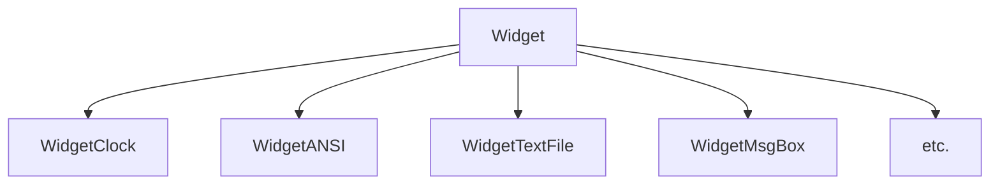
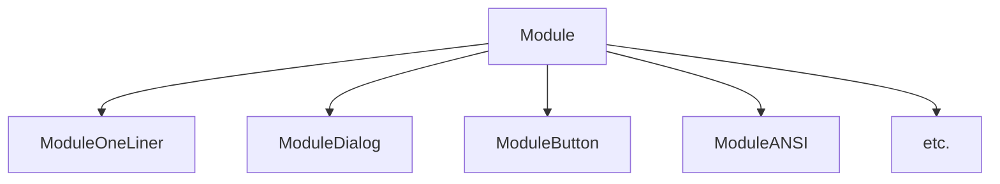
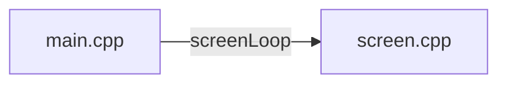

# term-temple

Multi-tool console application / fantasy text-mode operating system.

Terminal printing is made with curses (ncrusesw for wide character support).

Yes it is currently graphically inspired by TempleOS.

# Usage

Install libncursesw5-dev ou juste libncurses-dev.
>make
>./term-temple && stty sane && clear
depuis src/

# Project

All the main curses calls (wmove() + wmaddnwstr()) are made in renderer.cpp. Renderer.cpp is made as a pass through to facilitate the migration to some other text mode (or graphical) library.

cursesANSI.cpp is the exception and along the basic ANSI art parser, there are few drawing calls that are made straight from curses library.

The goal of the project is to make a simple window manager, with a few tools inside (clock, text file reader, ANSI art reader, calculator etc.) so it feels like a text-mode pseudo operating system.

Curses library is not made to intensive graphics / working in realtime, the way the WINDOW object are redrawn etc. 

So the trick is to use 0 capabilities of Curses (WINDOW or other lib (menu etc.)) to handle manually the rendering and using only the 'stdscr' WINDOW object Curses expose to draw everything.

I ended up wording the elements like this :
 - WIDGETS are like windows
 - MODULES are smaller components that are inside windows (there are some exception where a module is not linked to a widget)

So my class WidgetManager would mean some sort of minimal window despktop manager. 

So basically screen.cpp is the main file that refresh a "Widget Manager" that refresh a vector of "Widgets". Each widgets then refresh their modules.

Basic key (and mouse) handling is made in screen.cpp in the main loop, and are pass through widgetManager and potentially to the 'focused Widget' (WidgetManager::focusWidget) afterward.

Key or mouse events may never go to a module, all the logic is either : 
 - Desktop mangement input (going in resize mode, moving a window, opening the app launcher)
 - Widget input (changing the clock size, scrolling in a textfile)

Screen has instanciated a global WidgetManager.
Main loop in screenLoop() do WidgetManager->draw() basically;

## REMARQUES

 - C'est un peu le bazard dans globals, leur nommage, la présence du wStatut dans screen comme ça.
 - Il y a des trucs nommés GameState par exemple et qui sont orientés car le but derrière serait justement d'ajouter Lua pour scripter et en faire un 'jeu' dont tout le gameplay serait basé sur des interactions dans ce 'fake os'.
 - Il y a encore plein de 'new' partout, est-ce que smart pointers all the way or not ?
 - En passant cppCheck et en ayant plein de log sur le scope des variables (puis en lisant un post ou deux) j'ai lu qu'il n'y avait bien qu'une seule alloc dans la stack pour une variable scopée dans une boucle par exemple et que assignation ou intialisation c'était la même donc on c'était les mêmes perfs donc pas une mauvaise pratique car donnait plus de sens...je l'ai fait à un ou deux endroits même si j'avoues que ça me fait drôle.

### Questions 

 - Est-ce que je dois privélégier de faire des const plutôt que des define ?
 - Est-ce que je dois apprendre à gérer CMake au lieu de faire des makefiles ?
 - (En bibliothèques je ne pense rajouter que : LuaCPP, et 2 petites en header only pour respectivement lire/écrire du JSON et lire de l'audio. À chaque fois ce sera des petites header only.)
 - Si je veux faire un jeu après je mettrais SDL ou similaire et ferais une couche entre SDL et mon renderer, puis refaire le gros du 'graphisme' non textuel (cadre de fenêtre etc.).
 - Garder le flag virtual à la place de override dans les méthodes surchargées dans les sous-classe pour la lisibilité etc.

## TODO

 - Dans WidgetANSI mettre juste un moduleANSI et dégager le code en doublon
 - Dans screen.cpp dégager le WINDOW* !!!! pas de trace de curses mettre un moduleOneLiner en pied (voir si mieux de le gérer dans le widgetManager qui a déjà du 'dur' pour le appLauncher par exemple) YES MOVE STATUS TO WMGR!
 - timeInMilliseconds() dans Utils() et tick() dans globals... ... ...
 - rename in globals 
 - rename mainDraw() as update() ?
 - faire WidgetResizable ou WidgetScrollable entre WidgetTextFile ou WidgetFileExplorer et base class Widget ?
 - Dans AppLauncher mettre des callbacks mappées au appNames
 - Plein de mémoire pas libérée (dans les spécif des widgets)