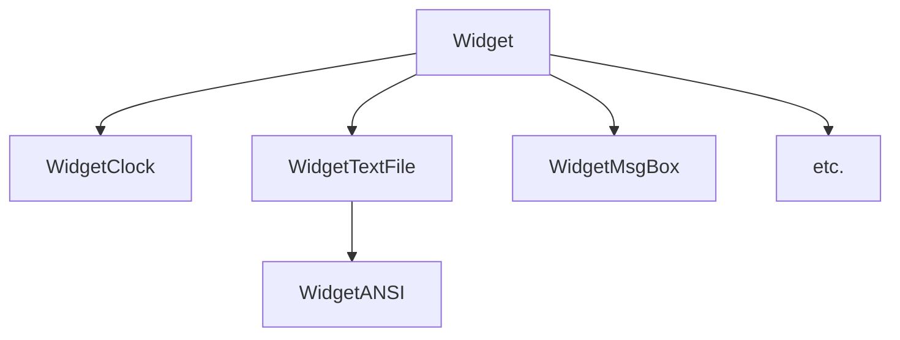
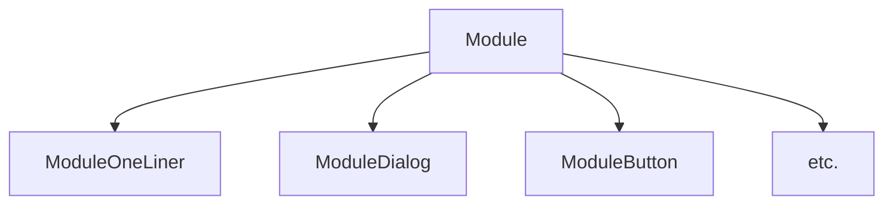
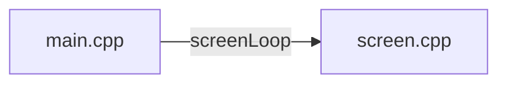

# term-temple :computer:

**Term Temple** is a multi-tool console application / fantasy text-mode operating system.

Terminal printing is made with the curses library (**ncursesw** for wide character support).

It is graphically inspired by TempleOS. I'm learning **modern C++** while making this project.

## Usage

You will need a color enabled terminal.

Currently suggested font is square font.

**Font** used for the screenshot is **Px AmstradPC1512 Regular** from the **"Old School PC Font Ressource"** website:

[Old School PC Font Ressource](https://int10h.org/oldschool-pc-fonts/fontlist/)

Other useful fonts:

[Nerd Fonts](https://www.nerdfonts.com/font-downloads)

Install libncursesw5-dev ou juste libncurses-dev.
Depuis 'src/' :

```
>make  
>./term-temple && stty sane && clear
```

### Screenshots :camera:


## Project

All the main curses calls (wmove() + wmaddnwstr()) are made in renderer.cpp. Renderer.cpp is made as a pass through to facilitate the migration to some other text mode (or graphical) library.

cursesANSI.cpp is the exception and along the basic ANSI art parser, there are few drawing calls that are made straight from curses library.

The goal of the project is to make a simple window manager, with a few tools inside (clock, text file reader, ANSI art reader, calculator etc.) so it feels like a text-mode pseudo operating system.

NCurses library is not made to intensive graphics / working in realtime, the way the WINDOW object are redrawn etc. :broken_heart:

So the trick is to use 0 capabilities of Curses (WINDOW or other lib (menu etc.)) to handle manually the rendering and using only the 'stdscr' WINDOW object Curses expose to draw everything.

I ended up wording the elements like this :
 - **WIDGETS** are like windows
 - **MODULES** are smaller components that are inside windows (there are some exception where a module is not linked to a widget)

So my class WidgetManager would mean some sort of minimal window despktop manager. 





So basically screen.cpp is the main file that refresh a "Widget Manager" that refresh a vector of "Widgets". Each widgets then refresh their modules.

Basic key (and mouse) handling is made in screen.cpp in the main loop, and are pass through widgetManager and potentially to the 'focused Widget' (WidgetManager::focusWidget) afterward.

Key or mouse events may never go to a module, all the logic is either : 
 - Desktop mangement input (going in resize mode, moving a window, opening the app launcher)
 - Widget input (changing the clock size, scrolling in a textfile)




Screen has instanciated a global WidgetManager.
Main loop in screenLoop() do WidgetManager->draw() basically;

## REMARQUES

 - C'est mon premier vrai projet en C++ après n'y avoir quasi pas toucher depuis quelques exos fait à l'école (en mode C with classes) il y a 20+ ans...
 - C'est un peu le bazard dans globals, leur nommage, la présence du wStatut dans screen comme ça.
 - Il y a des trucs nommés GameState par exemple et qui sont orientés car le but derrière serait justement d'ajouter Lua pour scripter et en faire un 'jeu' dont tout le gameplay serait basé sur des interactions dans ce 'fake os'.
 - (En bibliothèques je ne pense rajouter que : LuaCPP, et 2 petites en header only pour respectivement lire/écrire du JSON et lire de l'audio.)
 - Si je veux faire un jeu après je mettrais SDL ou similaire et ferais une couche entre SDL et mon renderer, puis refaire le gros du 'graphisme' non textuel (cadre de fenêtre etc.).
 - J'ai appris que je pouvais scoper au plus juste et que même déclarer une variable dans une boucle n'était pas une aberration maintenant malgré avoir toujours appris l'inverse (toujours déclarer les variables en premier au début des fonctions)... 
 - Je commence à lire les Core Guidelinesh...
 - Je me rends compte qu'en utilisant un gros superset de fonctions et classes template comme exposé par la STL, c'est ultra cool. Maintenant je vois que pour vraiment bien me servir du C++ il me manque un entendement complet sur les sémantiques de copie et move, bien comprendre les différences entre rvalue et lvalue, comment est résolu la recherche de prototype, etc. j'ai encore du taff de ce côté là.

### Questions 

 - Il y a encore plein de 'new' partout, est-ce que smart pointers all the way or not ?
 - Est-ce que je dois privélégier de faire des const plutôt que des define ?
 - Est-ce que je dois apprendre à gérer CMake au lieu de faire des makefiles ?


## TODO

 - [x] Dans WidgetANSI mettre juste un moduleANSI et dégager le code en doublon
 - [ ] Dans screen.cpp dégager le WINDOW* !!!! pas de trace de curses mettre un moduleOneLiner en pied (voir si mieux de le gérer dans le widgetManager qui a déjà du 'dur' pour le appLauncher par exemple) YES MOVE STATUS TO WMGR!
 - [ ] timeInMilliseconds() dans Utils() et tick() dans globals... ... ...
 - [ ] rename in globals 
 - [ ] rename mainDraw() as update() ?
 - [ ] faire WidgetResizable ou WidgetScrollable entre WidgetTextFile ou WidgetFileExplorer et base class Widget ?
 - [ ] Dans AppLauncher mettre des callbacks mappées au appNames
 - [ ] Plein de mémoire pas libérée (dans les spécif des widgets)